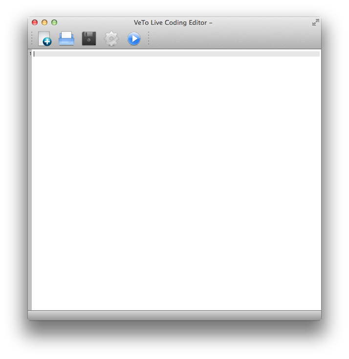
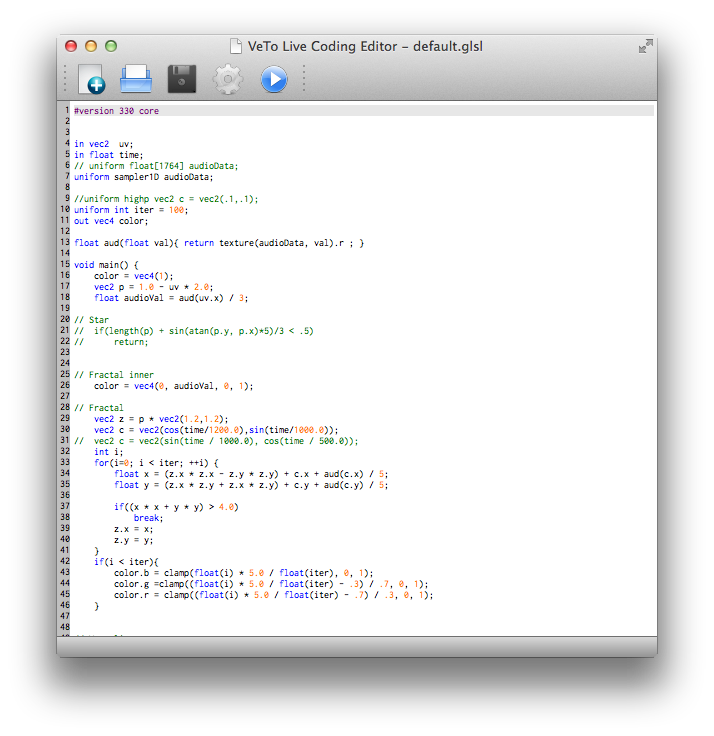
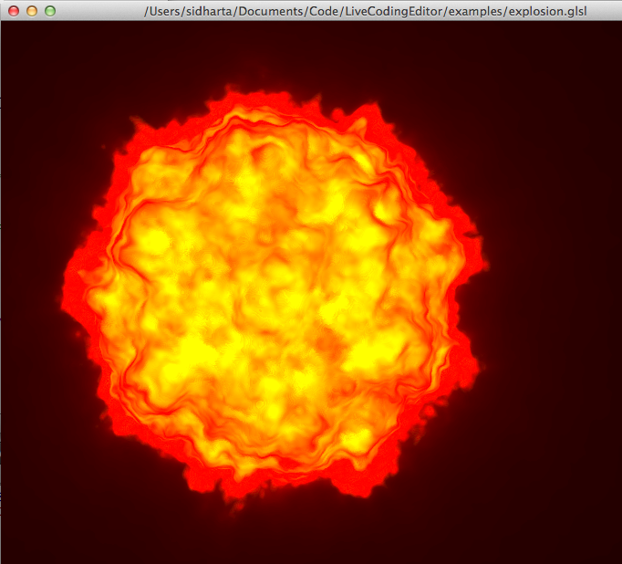
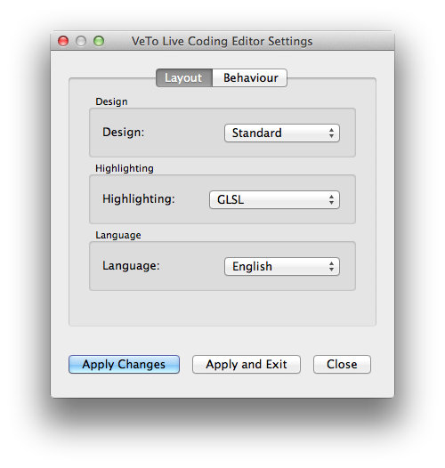
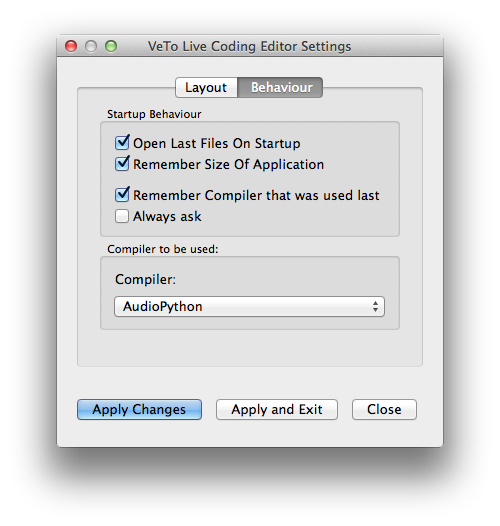

ShaderSandbox
=============

<!---->

A reasonably light-weight Testing Environment for Shaders in QT/C++, enabling you to apply shaders to models
and change them in real-time. In order to get the shader sandbox to compile from source, you will have to install QT 
as well(naturally). The editor works platform-independently.

Table of Contents
-----------------
1. **[Maintainers](#maintainers)**
2. **[Capabilities](#capabilities)**
3. **[Compilation](#compilation)**
4. **[Usage](#usage)**
5. **[Settings](#settings)**
6. **[Examples & Resources](#examples--resources)**
7. **[Contribute](#contribute)**

Maintainers
-----------

* Tobias Brosge (<s0539713@htw-berlin.de>)
* Veit Heller (<s0539501@htw-berlin.de>, <veit.heller@htw-berlin.de>)

Capabilities
------------

As stated above, this repo implements a live coding environment for shaders and models in QT.
Apart from live coding, it will also enable you to transform your shaders based on time, mouse position
and audio input. Find out more on its' usage [below](#usage).

Compilation
-----------

The somewhat tedious QT toolchain is hidden behind a make toolchain, enabling to run `make && make install`.
You might need to sudo to install, as usual. If the compilation issues an error like `qmake: command not found`,
you might have to do something along the lines of `make QMAKE=/path/to/your/qmake`. You can also customized
install directory and stuff like that, you might want to take a quick look at the (very slim) Makefile to
find out what to override in order to do that.

Usage
-----

If you open the application for the first time, you will be greeted by an empty editor - that
will be your playground.

Default syntax highlighting will be GLSL, but you can tweak the settings to highlight Python
code as well. There are a few minor differences, but generally, we use GLSL highlighting for
Python, as it is good enough for our lazy asses(but we code in Vim, too, so we might not be the
best users for scale).

You might want to take a ride and you can(on every platform we know of, provided there is OpenGL
and GLSL installed). There are some examples in the `examples` directory, you will need models
to be rendered, though. We are not Digital Artists and do not have licenses for any models.
The glsl files are mostly from [the glsl playground](https://glsl.heroku.com). Check it out, it's 
awesome! We're a bit jealous of th project, because
they are browser-based and hip and all, but we still like to use desktop apps(old-fashioned, huh?).
If you open and run them, you can play around with it very well(run it by hitting the systems refresh 
action(`F5` on Windows and Linux, `Cmd+R` on OS X)). A new window will pop open that renders the shader
applied to the model. Our personal preference is to drag rendering windows to a different screen so you 
have a clean workbench. If you change something, you can hit refresh at every point in your development 
and the updated code will be run. If it does not compile, a message will tell you so(either as a popup or
as an exception in the bottom part of the editor).

That's it with the basics. Have fun!

Settings
--------

Settings capabilities are important for every IDE. In our editor preferences are set per-tab,
because you might want to code graphics and audio live(if you can pull that off, you are a 
genius!) and if you set them before the session, that will save an enormous amount of time.

The settings window(which can be reached by pressing the little cogwheel button) should
be pretty self-explaining, but we will explain it non-the-less.

In the first tab there are few things you can tweak regarding layout:

**Design**:

There you can adjust the editor design. It is based on the styles that are available by
default from QT(mostly Windows and Fusion, but on certain platforms also other designs,
e.g. Mac or KDE).

**Highlighting**:

There you can change the syntax highlighting(or even switch it off).

**Language**:

At the moment, only english and german are supported. An experimental version
of french is being created, but we do not trust our french very much. Not more than
our spanish and japanese, so all three of them will take a while.

In the second tab you can adjust the editors' behaviour to your liking:

**Startup behaviour**:

In this pane you can adjust the editors behaviour on startup. Most people will keep them
as they are, I guess, but if you want to start everything from scratch every time, you might
toggle all of them.

**Compiler**:

This is the most important part of the settings window. There you are able to change the 
compiler/interpreter that is used for your code.

Examples & Resources
--------------------

Examples are located in the `examples` dir.

**For developers:**

If you want to help making the editor better, there is a `doc` endpoint in the Makefile that
will create Doxygen-based documentation.

Contribute
----------

If you want to contribute, please try to adhere to the C++11/C++14 standards and mostly Qt5.4.
Refactorings are very welcome.
